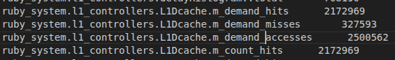

# Analysis of a Cache Optimization Strategy in gem5

This project involves a dive into cache performance analysis and optimization using the gem5 simulator. The primary goal is to investigate methods for improving the efficiency of a processor's memory hierarchy. The primary focus of this study is the analysis of a Victim Cache within the Ruby memory subsystem. The analysis explores its impact on performance by measuring key metrics like miss rates and Average Memory Access Time (AMAT) across various micro-benchmarks and workloads.

# Victim Cache Analysis in gem5

A **Victim Cache** is a cache optimization that reduces the conflict miss penalty incurred by the L1 cache by storing and serving recently evicted blocks. In this project, I evaluated this property of the victim cache through a series of experiments using the **gem5** simulator.

---

## Table of Contents
1. [Introduction to Victim Cache](#introduction-to-victim-cache)   
2. [Experiments](#experiments)  
   - [Experiment 1 : Configuration and Custom Statistic](#experiment-1)  
   - [Experiment 2: Victim Cache Effectiveness on Microbenchmarks](#experiment-2)  
   - [Experiment 3](#experiment-3)  
   - [Experiment 4](#experiment-4)  
   - [Experiment 5](#experiment-5)  
3. [Implementation Details](#implementation-details)
4. [Future Work](#future-work)  
5. [Reference](#reference)  

---

## Introduction to Victim Cache
A **Victim Cache** is a small, fully-associative cache placed between the L1 cache and the next level of memory hierarchy. It temporarily stores cache lines evicted from the L1 cache, providing another chance to hit before going to L2 or main memory.  

This design helps reduce **miss penalty** while keeping the L1 cache simple and fast.  

Below is a high-level schematic of where the Victim Cache is placed in the hierarchy:

<p align="left">
  
</p>

---

## Experiments

### Experiment 1: Configuration Test with Custom Statistic

#### Task
The only objective of this experiment was to correctly add and verify a custom statistic (`m_count_hits`) to the Ruby memory system in gem5. This counter tracked **L1-D cache hits** and was compared against the predefined `m_demand_hits` counter for verification.

#### Configuration

| Component             | Configuration                |
|-----------------------|------------------------------|
| CPU                   | TIMING, 1 core (ARM ISA)     |
| L1 Data Cache         | 16 KiB, 8-way associative    |
| L1 Instruction Cache  | 16 KiB, 8-way associative    |
| L2 Cache              | 256 KiB, 16-way associative  |
| Memory                | SingleChannelDDR4_2400       |
| Clock Frequency       | 3 GHz                        |
| Workload              | GAPBS BFS (ARM binary)       |

#### Result

<p align="left">
  
</p>

- The custom statistic `m_count_hits` appeared in `stats.txt`.  
- Its value exactly matched gem5’s built-in counter `m_demand_hits` for the L1-D cache.  
- This verified that the counter was correctly integrated into the Ruby subsystem.

---

### Experiment 2: Victim Cache Effectiveness on Microbenchmarks

#### Task
The goal of this experiment was to study the **effectiveness of the victim cache** on a set of simple microbenchmarks. The programs were designed to stress the cache with different access behaviors:
- **Matrix Transpose** – a compute-heavy kernel with regular memory access patterns.  
- **Tiny Access Pattern** – 50 iterations of a small loop.  
- **Medium Access Pattern** – 100 iterations of the same loop.  
- **Full Access Pattern** – 1000 iterations, stressing the cache capacity and conflict behavior.  

This setup enables us to observe how the victim cache responds to workloads with increasing intensity and memory pressure.

#### Setup / Configuration

| Component             | Configuration                |
|-----------------------|------------------------------|
| CPU                   | TIMING, 1 core (X86 ISA)     |
| L1 Data Cache         | 8 KiB, 2-way associative     |
| L1 Instruction Cache  | 16 KiB, 8-way associative    |
| L2 Cache              | 256 KiB, 16-way associative  |
| Memory                | SingleChannelDDR4_2400       |
| Clock Frequency       | 3 GHz                        |

#### Metrics and Formulae

For each program we collected:
- `l1d.m_demand_hits`, `l1d.m_demand_misses`, `l1d.m_demand_accesses`  
- `m_victim_hits`, `m_victim_misses`  

From these, the following derived metrics are reported:

```
L1_Hit_Rate        =   l1d.m_demand_hits / l1d.m_demand_accesses
VC_Hit_Rate        =   m_victim_hits / l1d.m_demand_misses
Combined_Hit_Rate  =   (l1d.m_demand_hits + m_victim_hits) / l1d.m_demand_accesses
Combined_Miss_Rate =   1 - Combined_Hit_Rate
```


### Experiment 3
- **Task:**  
- **Setup/Config:**  
- **Result:**  
- **Key Takeaway:**  

### Experiment 4
- **Task:**  
- **Setup/Config:**  
- **Result:**  
- **Key Takeaway:**  

### Experiment 5
- **Task:**  
- **Setup/Config:**  
- **Result:**  
- **Key Takeaway:**  

---

## Implementation Details
The implementation steps, file modifications, and code snippets are documented in [IMPLEMENTATION.md](IMPLEMENTATION.md).

## Future Work
The following extensions and optimizations can be explored as part of future work:
- **Way Prediction** – predicting the matching way in set-associative caches to reduce access latency.  
- **Prefetching** – preloading likely-to-be-used cache lines.  
- **Critical Word First / Early Restart** – prioritizing the word requested by the CPU to reduce stall time.  
- **NoC-based Cache Coherence Protocol Analysis** – exploring victim cache impact in multi-core and network-on-chip scenarios.  

---

## Reference
For details about the base gem5 simulator, please refer to [README_gem5.md](README_gem5.md) included in this repository.
